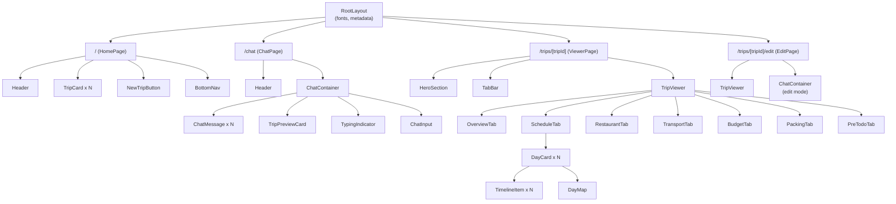
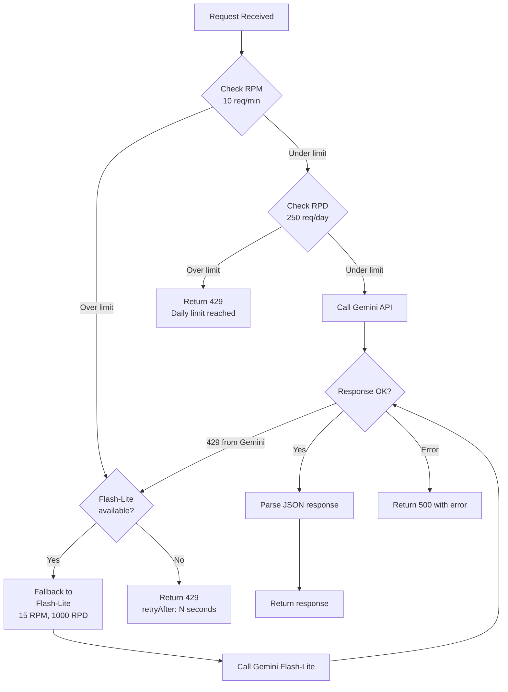
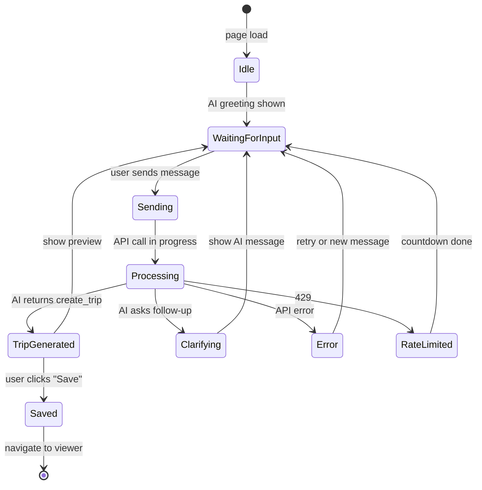
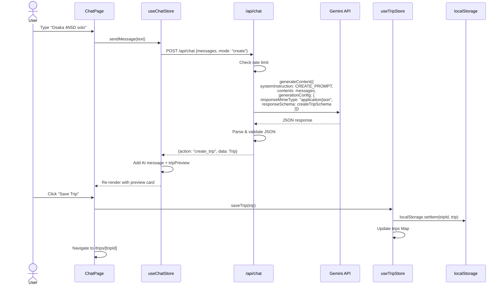
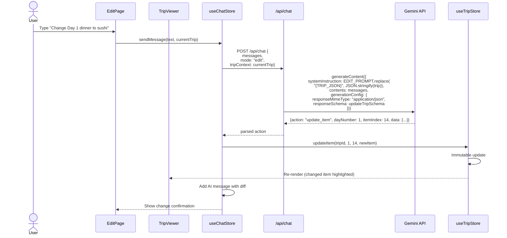
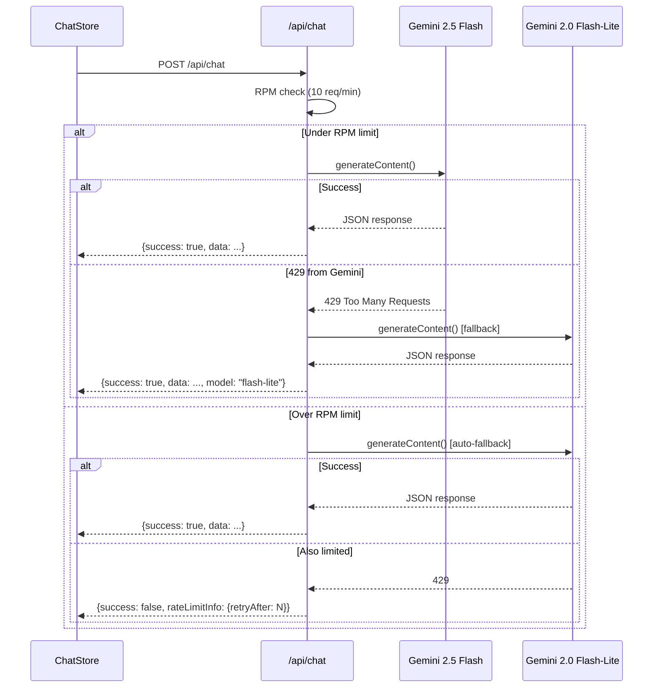

# AI Travel Planner Prototype - Design Document

> **Project**: ai-travel-planner
> **Author**: kimjin-wan
> **Date**: 2026-02-24
> **Status**: Draft
> **Base**: [ai-travel-planner-prototype.plan.md](../../01-plan/features/ai-travel-planner-prototype.plan.md)

---

## 1. Project Directory Structure

> **아키텍처 원칙**: [Practical React Architecture](../../practical-react-architecture.md) 기반
> - **3개 레이어 기본**: `api/` (서버 연동 + 변환) → `stores/` (상태 관리) → `components/` (UI)
> - **복잡도에 비례해서 레이어 추가**: 단순 CRUD는 3레이어, 복잡한 로직만 `domain/` 또는 `hooks/` 추가
> - **DTO는 api 파일 안에 지역적으로 선언**: 별도 dtos/, transformers/ 폴더 없음
> - **컴포넌트는 API 응답 구조를 모름**: Domain 타입만 사용

```
ai-travel-planner/
├── .env.local                     # GEMINI_API_KEY
├── next.config.ts
├── tailwind.config.ts
├── tsconfig.json
├── package.json
├── public/
│   ├── manifest.json              # PWA manifest
│   ├── sw.js                      # Service Worker (next-pwa)
│   ├── icons/                     # PWA icons (192x192, 512x512)
│   └── seed/
│       └── osaka-2026.json        # Seed data (osaka HTML -> JSON)
│
├── src/
│   ├── app/                       # Next.js App Router (페이지만)
│   │   ├── layout.tsx             # Root layout (fonts, metadata, PWA)
│   │   ├── page.tsx               # Home: trip list
│   │   ├── globals.css            # Tailwind directives + CSS variables
│   │   ├── trips/[tripId]/
│   │   │   ├── page.tsx           # Trip viewer (7-tab)
│   │   │   └── edit/page.tsx      # Trip viewer + AI edit mode
│   │   ├── chat/page.tsx          # AI chat (new trip creation)
│   │   └── api/chat/route.ts     # Gemini API Route Handler
│   │
│   ├── api/                       # ★ API Layer (서버 연동 + DTO + 변환)
│   │   └── gemini.ts              # Gemini SDK + 프롬프트 + 스키마 + 파싱 + 변환
│   │                              #   - DTO(Gemini 응답 구조)는 이 파일 안에서만 존재
│   │                              #   - 컴포넌트는 이 파일의 함수만 호출
│   │                              #   - Domain 타입(Trip)을 반환
│   │
│   ├── types/                     # ★ Domain Types (프론트엔드 관점)
│   │   └── trip.ts                # Trip, Day, TimelineItem 등 모든 도메인 타입
│   │                              #   - API 응답 구조(DTO)와 독립적
│   │                              #   - UI에서 편하게 쓸 수 있는 형태
│   │
│   ├── stores/                    # ★ State Management (Zustand)
│   │   ├── useTripStore.ts        # Trip 데이터 CRUD + localStorage 연동
│   │   └── useChatStore.ts        # 채팅 메시지 + AI 요청/응답 처리
│   │                              #   - api/gemini.ts 함수를 호출
│   │                              #   - 결과를 Domain 타입으로 상태에 저장
│   │
│   ├── components/                # ★ UI Components (렌더링에 집중)
│   │   ├── layout/
│   │   │   ├── Header.tsx
│   │   │   └── BottomNav.tsx
│   │   ├── home/
│   │   │   ├── TripCard.tsx
│   │   │   └── NewTripButton.tsx
│   │   ├── chat/
│   │   │   ├── ChatContainer.tsx
│   │   │   ├── ChatMessage.tsx
│   │   │   ├── ChatInput.tsx
│   │   │   ├── TripPreviewCard.tsx
│   │   │   └── TypingIndicator.tsx
│   │   └── viewer/
│   │       ├── TripViewer.tsx
│   │       ├── TabBar.tsx
│   │       ├── HeroSection.tsx
│   │       ├── tabs/             # 7개 탭 컴포넌트
│   │       │   ├── OverviewTab.tsx
│   │       │   ├── ScheduleTab.tsx
│   │       │   ├── RestaurantTab.tsx
│   │       │   ├── TransportTab.tsx
│   │       │   ├── BudgetTab.tsx
│   │       │   ├── PackingTab.tsx
│   │       │   └── PreTodoTab.tsx
│   │       ├── schedule/         # 일정 탭 하위 컴포넌트
│   │       │   ├── DayCard.tsx
│   │       │   ├── TimelineItem.tsx
│   │       │   └── DayMap.tsx    # dynamic import (SSR-safe)
│   │       └── shared/           # 뷰어 공용 컴포넌트
│   │           ├── InfoCard.tsx
│   │           ├── InfoGrid.tsx
│   │           ├── Tip.tsx
│   │           └── SectionTitle.tsx
│   │
│   ├── domain/                    # [필요시] 순수 비즈니스 로직
│   │   └── trip.ts                #   - applyTripAction(): AI 액션 → Trip 부분 업데이트
│   │                              #   - React 없이 동작하는 순수 함수만
│   │                              #   - 3개 이상 분기가 있을 때만 추출
│   │
│   └── lib/                       # 유틸리티 (프레임워크 독립)
│       ├── storage.ts             # localStorage wrapper
│       ├── constants.ts           # Color palette, tab config
│       └── formatters.ts          # Date, currency formatters
│
└── seed/
    └── convert-osaka-html.ts      # Script: HTML -> JSON seed data
```

### 1.1 레이어 흐름 (3레이어 기본)

```
컴포넌트(UI)         Store(상태)           API Layer(서버 연동)
┌────────────┐    ┌────────────────┐    ┌─────────────────────────┐
│ ChatPage   │ ──> │ useChatStore   │ ──> │ api/gemini.ts           │
│ TripViewer │    │ useTripStore   │    │  - Gemini SDK 초기화      │
│            │    │ + 캐시/로딩     │    │  - 프롬프트 + 스키마      │
│            │    │ + localStorage │    │  - DTO → Domain 변환      │
└────────────┘    └────────────────┘    │  - Rate Limit 처리        │
  렌더링에 집중       상태 관리             └─────────────────────────┘
                                          Gemini API 연결 + 변환
```

### 1.2 복잡도별 적용 가이드

| 복잡도 | 예시 | 사용 레이어 |
|--------|------|------------|
| **낮음** | Trip 목록 조회, 탭 전환 | `stores/` + `components/` (2레이어) |
| **중간** | AI 채팅으로 Trip 생성 | `api/` + `stores/` + `components/` (3레이어) |
| **높음** | AI 부분 수정 (액션 파싱 + 적용) | + `domain/trip.ts` 추가 (4레이어) |

> **💡 핵심 원칙:** 모든 기능에 동일한 구조를 강제하지 마세요. 단순한 탭 전환에 4개 파일을 만드는 것은 오버엔지니어링이고, AI 응답 파싱 로직을 컴포넌트에 넣는 것은 기술 부채입니다.

---

## 2. Component Structure

### 2.1 Component Tree



### 2.2 Component Responsibilities & Props

#### Layout Components

| Component | Responsibility | Key Props |
|-----------|---------------|-----------|
| `Header` | App title, back navigation | `title?: string`, `showBack?: boolean` |
| `BottomNav` | Mobile navigation (Home / Chat / Trips) | `activeTab: 'home' \| 'chat' \| 'trips'` |

#### Home Components

| Component | Responsibility | Key Props |
|-----------|---------------|-----------|
| `TripCard` | Display trip summary card | `trip: TripSummary`, `onClick: () => void` |
| `NewTripButton` | CTA to navigate to chat | (none) |

#### Chat Components

| Component | Responsibility | Key Props |
|-----------|---------------|-----------|
| `ChatContainer` | Manages message list, scroll, send | `mode: 'create' \| 'edit'`, `tripId?: string` |
| `ChatMessage` | Renders single message bubble | `message: ChatMessage`, `isUser: boolean` |
| `ChatInput` | Text input + send button | `onSend: (text: string) => void`, `disabled: boolean` |
| `TripPreviewCard` | Compact trip preview inside chat | `trip: Trip` |
| `TypingIndicator` | "AI is thinking..." dots animation | (none) |

#### Viewer Components

| Component | Responsibility | Key Props |
|-----------|---------------|-----------|
| `TripViewer` | Tab state management, renders active tab | `trip: Trip` |
| `TabBar` | Sticky 7-tab navigation | `activeTab: TabId`, `onChange: (tab: TabId) => void` |
| `HeroSection` | Trip title, dates, tags banner | `trip: Trip` |

#### Tab Components

| Component | Responsibility | Key Props |
|-----------|---------------|-----------|
| `OverviewTab` | Flights, hotel, weather, daily summary | `overview: TripOverview`, `days: Day[]` |
| `ScheduleTab` | Day cards with timeline + map | `days: Day[]` |
| `RestaurantTab` | Restaurant cards grouped by day | `days: Day[]`, `restaurants: Restaurant[]` |
| `TransportTab` | Routes table, ICOCA guide, pass comparison | `transport: TransportSection` |
| `BudgetTab` | Budget items with bars + total | `budget: BudgetSection` |
| `PackingTab` | Checklist with categories | `packing: PackingItem[]` |
| `PreTodoTab` | Pre-trip todo list | `preTodos: PreTodoItem[]` |

#### Schedule Sub-Components

| Component | Responsibility | Key Props |
|-----------|---------------|-----------|
| `DayCard` | Collapsible day with header + body | `day: Day`, `defaultOpen?: boolean` |
| `TimelineItem` | Single timeline entry (time, title, desc) | `item: TimelineItem` |
| `DayMap` | Leaflet map with numbered markers + route | `spots: MapSpot[]`, `color: string` |

#### Shared Components

| Component | Responsibility | Key Props |
|-----------|---------------|-----------|
| `InfoCard` | Label + value + sub card | `label: string`, `value: string`, `sub?: string` |
| `InfoGrid` | Grid layout for InfoCards | `children: ReactNode` |
| `Tip` | Tip/warning box | `variant: 'tip' \| 'warn'`, `children: ReactNode` |
| `SectionTitle` | Section heading with emoji icon | `icon: string`, `bgColor: string`, `children: ReactNode` |

---

## 3. Data Model

### 3.1 Core Types (`src/types/trip.ts`)

```typescript
// ============================================================
// Root Entity
// ============================================================

interface Trip {
  id: string;                    // nanoid or uuid
  title: string;                 // "osaka-yeohaeng-wanjeonpan"
  destination: string;           // "osaka"
  startDate: string;             // ISO "2026-03-02"
  endDate: string;               // ISO "2026-03-06"
  travelers: number;
  tags: string[];                // ["osaka", "kyoto", "nara", "kobe"]
  overview: TripOverview;
  days: Day[];
  restaurants: Restaurant[];
  transport: TransportSection;
  budget: BudgetSection;
  packing: PackingItem[];
  preTodos: PreTodoItem[];
  createdAt: string;             // ISO datetime
  updatedAt: string;             // ISO datetime
}

// ============================================================
// Overview
// ============================================================

interface TripOverview {
  flights: Flight[];
  accommodation: Accommodation;
  weather: WeatherDay[];
  tips: string[];                // general tips
}

interface Flight {
  direction: 'outbound' | 'inbound';
  departure: string;             // "Gimpo Airport"
  arrival: string;               // "Kansai Airport"
  departureTime: string;         // "08:30"
  arrivalTime: string;           // "10:30"
  date: string;                  // "2026-03-02"
  duration: string;              // "2h"
  note?: string;
}

interface Accommodation {
  name: string;
  address: string;
  area: string;                  // "Umeda / Kita Ward"
  nearbyStations: string[];      // ["JR Osaka Station 10min", ...]
}

interface WeatherDay {
  date: string;
  dayOfWeek: string;             // "Mon"
  icon: string;                  // emoji
  tempHigh: number;
  tempLow: number;
  tempAvg: number;
}

// ============================================================
// Day / Timeline
// ============================================================

interface Day {
  dayNumber: number;             // 1-based
  date: string;                  // ISO "2026-03-02"
  title: string;                 // "Osaka Arrival & Umeda"
  subtitle: string;              // "Nakanoshima -> Tenjinbashi -> Sky Building"
  color: string;                 // hex "#f97316"
  items: TimelineItem[];
  mapSpots: MapSpot[];
}

type TimelineItemType = 'spot' | 'food' | 'move' | 'default';

interface TimelineItem {
  time: string;                  // "08:30"
  title: string;
  description?: string;
  type: TimelineItemType;
  cost?: number;
  currency?: 'JPY' | 'KRW';
  badge?: string;                // "Lunch", "Flight 2h", etc.
}

interface MapSpot {
  lat: number;
  lng: number;
  name: string;
  time: string;
  icon: string;                  // emoji
}

// ============================================================
// Restaurants
// ============================================================

interface Restaurant {
  dayNumber: number;
  category: string;              // "Sushi", "Ramen", etc.
  name: string;
  rating: number;                // 4.2
  reviewCount?: string;          // "3,500+"
  description: string;
  priceRange: string;            // "JPY1,000~"
}

// ============================================================
// Transport
// ============================================================

interface TransportSection {
  homeToHotel: TransportStep[];  // step-by-step guide
  intercityRoutes: TransportRoute[];
  stationNames: StationName[];
  passes: TransportPass[];
  passVerdict: string;           // summary recommendation
  icocaGuide: string[];          // step-by-step ICOCA guide
  tips: string[];
}

interface TransportStep {
  icon: string;
  title: string;
  subtitle: string;
}

interface TransportRoute {
  from: string;
  to: string;
  method: string;                // "Haruka Express"
  duration: string;              // "50min"
  cost: string;                  // "JPY1,800"
}

interface StationName {
  korean: string;
  japanese: string;
  english: string;
}

interface TransportPass {
  name: string;
  price: string;
  recommendation: 'recommended' | 'neutral' | 'not-recommended';
  reason: string;
}

// ============================================================
// Budget
// ============================================================

interface BudgetSection {
  items: BudgetItem[];
  total: BudgetRange;
  styles: BudgetStyle[];         // "budget", "moderate", "luxury"
  tips: string[];
}

interface BudgetItem {
  icon: string;
  label: string;                 // "Transportation"
  detail: string;
  amount: string;                // "JPY8,000" or "JPY15,000~20,000"
  percentage: number;            // 0-100 for bar width
  color: string;                 // Tailwind color or hex
}

interface BudgetRange {
  min: string;                   // "JPY36,000"
  max: string;                   // "JPY47,000"
  minKRW: string;                // "320,000"
  maxKRW: string;                // "420,000"
}

interface BudgetStyle {
  label: string;                 // "Budget" / "Moderate" / "Luxury"
  amount: string;
  description: string;
  isRecommended?: boolean;
}

// ============================================================
// Packing & Pre-Todos
// ============================================================

interface PackingItem {
  category: string;              // "Documents", "Electronics", etc.
  categoryIcon: string;          // emoji
  items: PackingEntry[];
}

interface PackingEntry {
  name: string;
  note?: string;
  checked: boolean;              // local state only, not from AI
}

interface PreTodoItem {
  order: number;
  title: string;
  description: string;
}

// ============================================================
// Trip Summary (for home list)
// ============================================================

interface TripSummary {
  id: string;
  title: string;
  destination: string;
  startDate: string;
  endDate: string;
  travelers: number;
  tags: string[];
  dayCount: number;
}
```

### 3.2 Gemini JSON Output Schema (`src/api/gemini.ts` 내부)

> Gemini `response_schema`는 OpenAPI 3.0 Schema 서브셋을 사용합니다.
> 이 스키마 정의는 `api/gemini.ts` 안에 DTO와 함께 존재합니다 (별도 파일 불필요).

```typescript
import { Type } from '@google/genai';

// Schema for "create_trip" action
export const createTripSchema = {
  type: Type.OBJECT,
  properties: {
    action: {
      type: Type.STRING,
      enum: ['create_trip'],
    },
    data: {
      type: Type.OBJECT,
      properties: {
        title: { type: Type.STRING },
        destination: { type: Type.STRING },
        startDate: { type: Type.STRING },
        endDate: { type: Type.STRING },
        travelers: { type: Type.NUMBER },
        tags: { type: Type.ARRAY, items: { type: Type.STRING } },
        overview: {
          type: Type.OBJECT,
          properties: {
            flights: {
              type: Type.ARRAY,
              items: {
                type: Type.OBJECT,
                properties: {
                  direction: { type: Type.STRING, enum: ['outbound', 'inbound'] },
                  departure: { type: Type.STRING },
                  arrival: { type: Type.STRING },
                  departureTime: { type: Type.STRING },
                  arrivalTime: { type: Type.STRING },
                  date: { type: Type.STRING },
                  duration: { type: Type.STRING },
                },
                required: ['direction', 'departure', 'arrival', 'departureTime', 'arrivalTime', 'date', 'duration'],
              },
            },
            accommodation: {
              type: Type.OBJECT,
              properties: {
                name: { type: Type.STRING },
                address: { type: Type.STRING },
                area: { type: Type.STRING },
                nearbyStations: { type: Type.ARRAY, items: { type: Type.STRING } },
              },
              required: ['name', 'address', 'area', 'nearbyStations'],
            },
            weather: {
              type: Type.ARRAY,
              items: {
                type: Type.OBJECT,
                properties: {
                  date: { type: Type.STRING },
                  dayOfWeek: { type: Type.STRING },
                  icon: { type: Type.STRING },
                  tempHigh: { type: Type.NUMBER },
                  tempLow: { type: Type.NUMBER },
                  tempAvg: { type: Type.NUMBER },
                },
                required: ['date', 'dayOfWeek', 'icon', 'tempHigh', 'tempLow', 'tempAvg'],
              },
            },
            tips: { type: Type.ARRAY, items: { type: Type.STRING } },
          },
          required: ['flights', 'accommodation', 'weather', 'tips'],
        },
        days: {
          type: Type.ARRAY,
          items: {
            type: Type.OBJECT,
            properties: {
              dayNumber: { type: Type.NUMBER },
              date: { type: Type.STRING },
              title: { type: Type.STRING },
              subtitle: { type: Type.STRING },
              color: { type: Type.STRING },
              items: {
                type: Type.ARRAY,
                items: {
                  type: Type.OBJECT,
                  properties: {
                    time: { type: Type.STRING },
                    title: { type: Type.STRING },
                    description: { type: Type.STRING },
                    type: { type: Type.STRING, enum: ['spot', 'food', 'move', 'default'] },
                    cost: { type: Type.NUMBER },
                    currency: { type: Type.STRING, enum: ['JPY', 'KRW'] },
                    badge: { type: Type.STRING },
                  },
                  required: ['time', 'title', 'type'],
                },
              },
              mapSpots: {
                type: Type.ARRAY,
                items: {
                  type: Type.OBJECT,
                  properties: {
                    lat: { type: Type.NUMBER },
                    lng: { type: Type.NUMBER },
                    name: { type: Type.STRING },
                    time: { type: Type.STRING },
                    icon: { type: Type.STRING },
                  },
                  required: ['lat', 'lng', 'name', 'time', 'icon'],
                },
              },
            },
            required: ['dayNumber', 'date', 'title', 'subtitle', 'color', 'items', 'mapSpots'],
          },
        },
        restaurants: {
          type: Type.ARRAY,
          items: {
            type: Type.OBJECT,
            properties: {
              dayNumber: { type: Type.NUMBER },
              category: { type: Type.STRING },
              name: { type: Type.STRING },
              rating: { type: Type.NUMBER },
              reviewCount: { type: Type.STRING },
              description: { type: Type.STRING },
              priceRange: { type: Type.STRING },
            },
            required: ['dayNumber', 'category', 'name', 'rating', 'description', 'priceRange'],
          },
        },
        transport: {
          type: Type.OBJECT,
          properties: {
            homeToHotel: {
              type: Type.ARRAY,
              items: {
                type: Type.OBJECT,
                properties: {
                  icon: { type: Type.STRING },
                  title: { type: Type.STRING },
                  subtitle: { type: Type.STRING },
                },
                required: ['icon', 'title', 'subtitle'],
              },
            },
            intercityRoutes: {
              type: Type.ARRAY,
              items: {
                type: Type.OBJECT,
                properties: {
                  from: { type: Type.STRING },
                  to: { type: Type.STRING },
                  method: { type: Type.STRING },
                  duration: { type: Type.STRING },
                  cost: { type: Type.STRING },
                },
                required: ['from', 'to', 'method', 'duration', 'cost'],
              },
            },
            passVerdict: { type: Type.STRING },
            tips: { type: Type.ARRAY, items: { type: Type.STRING } },
          },
          required: ['homeToHotel', 'intercityRoutes', 'passVerdict', 'tips'],
        },
        budget: {
          type: Type.OBJECT,
          properties: {
            items: {
              type: Type.ARRAY,
              items: {
                type: Type.OBJECT,
                properties: {
                  icon: { type: Type.STRING },
                  label: { type: Type.STRING },
                  detail: { type: Type.STRING },
                  amount: { type: Type.STRING },
                  percentage: { type: Type.NUMBER },
                  color: { type: Type.STRING },
                },
                required: ['icon', 'label', 'detail', 'amount', 'percentage', 'color'],
              },
            },
            total: {
              type: Type.OBJECT,
              properties: {
                min: { type: Type.STRING },
                max: { type: Type.STRING },
                minKRW: { type: Type.STRING },
                maxKRW: { type: Type.STRING },
              },
              required: ['min', 'max', 'minKRW', 'maxKRW'],
            },
            tips: { type: Type.ARRAY, items: { type: Type.STRING } },
          },
          required: ['items', 'total', 'tips'],
        },
        packing: {
          type: Type.ARRAY,
          items: {
            type: Type.OBJECT,
            properties: {
              category: { type: Type.STRING },
              categoryIcon: { type: Type.STRING },
              items: {
                type: Type.ARRAY,
                items: {
                  type: Type.OBJECT,
                  properties: {
                    name: { type: Type.STRING },
                    note: { type: Type.STRING },
                  },
                  required: ['name'],
                },
              },
            },
            required: ['category', 'categoryIcon', 'items'],
          },
        },
        preTodos: {
          type: Type.ARRAY,
          items: {
            type: Type.OBJECT,
            properties: {
              order: { type: Type.NUMBER },
              title: { type: Type.STRING },
              description: { type: Type.STRING },
            },
            required: ['order', 'title', 'description'],
          },
        },
      },
      required: [
        'title', 'destination', 'startDate', 'endDate', 'travelers',
        'tags', 'overview', 'days', 'restaurants', 'transport',
        'budget', 'packing', 'preTodos',
      ],
    },
  },
  required: ['action', 'data'],
};

// Schema for "update" actions
export const updateTripSchema = {
  type: Type.OBJECT,
  properties: {
    action: {
      type: Type.STRING,
      enum: [
        'update_day',         // modify a day's items
        'update_item',        // modify a single timeline item
        'add_item',           // add a timeline item
        'remove_item',        // remove a timeline item
        'update_restaurant',  // modify restaurant list
        'update_budget',      // modify budget
        'update_overview',    // modify overview section
        'update_transport',   // modify transport section
        'update_packing',     // modify packing list
        'update_pretodos',    // modify pre-todos
        'replace_trip',       // full replacement (major changes)
      ],
    },
    message: { type: Type.STRING },  // AI's explanation to user
    dayNumber: { type: Type.NUMBER },
    itemIndex: { type: Type.NUMBER },
    data: { type: Type.OBJECT },     // partial data matching the action
  },
  required: ['action', 'message'],
};
```

---

## 4. State Management (Zustand)

> **아키텍처 원칙**: Store는 `api/gemini.ts`의 함수를 호출하고, Domain 타입(`Trip`)을 받아 상태를 관리합니다.
> Store가 Gemini 응답 구조를 알 필요 없습니다. 변환은 API Layer에서 처리됩니다.

### 4.1 Trip Store (`src/stores/useTripStore.ts`)

```typescript
import { Trip, TripSummary } from '@/types/trip';
import { storage } from '@/lib/storage';

interface TripState {
  // Data
  trips: Map<string, Trip>;
  currentTripId: string | null;

  // Computed
  tripList: TripSummary[];           // derived from trips

  // Actions — localStorage 연동은 Store가 담당 (3레이어: Store = 상태 + 저장)
  loadTrips: () => void;
  saveTrip: (trip: Trip) => void;
  deleteTrip: (tripId: string) => void;
  setCurrentTrip: (tripId: string) => void;

  // Partial Update — domain/trip.ts의 순수 함수를 호출
  applyAction: (tripId: string, action: TripAction) => void;

  // Packing (local-only state)
  togglePackingItem: (tripId: string, category: string, itemName: string) => void;
}
```

### 4.2 Chat Store (`src/stores/useChatStore.ts`)

```typescript
import { geminiApi } from '@/api/gemini';  // API Layer 호출
import type { Trip } from '@/types/trip';

interface ChatState {
  // Data
  messages: ChatMessage[];
  isLoading: boolean;
  error: string | null;

  // Actions
  sendMessage: (text: string, tripContext?: Trip) => Promise<void>;
  clearMessages: () => void;
}

// sendMessage 내부 흐름:
// 1. useChatStore.sendMessage(text, tripContext)
// 2. → POST /api/chat (Next.js Route Handler)
// 3. → /api/chat이 geminiApi.chat() 호출 → Domain 타입 반환
// 4. → Store에 AI 메시지 + Trip 데이터 저장
// 5. → 컴포넌트 자동 리렌더링
```

### 4.3 Chat Message Type (`src/types/trip.ts`에 포함)

```typescript
// Chat 전용 타입도 types/trip.ts에 함께 정의 (별도 파일 불필요)
interface ChatMessage {
  id: string;
  role: 'user' | 'assistant' | 'system';
  content: string;
  timestamp: number;
  tripAction?: TripAction;         // 파싱된 AI 액션 (있는 경우)
  tripPreview?: Trip;              // 생성/수정된 여행 데이터
}

// AI 응답에서 파싱된 액션 (Domain 타입)
interface TripAction {
  action: TripActionType;
  message: string;                 // AI 설명 메시지
  dayNumber?: number;
  itemIndex?: number;
  data?: unknown;                  // 액션별 데이터
}

type TripActionType =
  | 'create_trip'
  | 'update_day'
  | 'update_item'
  | 'add_item'
  | 'remove_item'
  | 'update_restaurant'
  | 'update_budget'
  | 'update_overview'
  | 'update_transport'
  | 'update_packing'
  | 'update_pretodos'
  | 'replace_trip';
```

---

## 5. API Route Design

> **아키텍처 원칙**: Route Handler는 얇게 유지합니다. 실제 로직은 `api/gemini.ts`에 있습니다.
> Route Handler → `geminiApi.chat()` → Gemini SDK → DTO 파싱 → Domain 타입 반환

### 5.1 API Layer (`src/api/gemini.ts`)

```typescript
// src/api/gemini.ts
// DTO, 프롬프트, 스키마, 변환 로직이 모두 이 파일에 존재
// 컴포넌트/Store는 이 파일의 함수만 호출하면 됨

// ── DTO (이 파일 안에서만 존재) ──────────────────
interface GeminiCreateResponse {
  action: 'create_trip';
  data: GeminiTripDTO;             // Gemini가 반환하는 원본 구조
}

interface GeminiUpdateResponse {
  action: string;
  message: string;
  dayNumber?: number;
  itemIndex?: number;
  data?: unknown;
}

// ── 변환 함수 (같은 파일에 배치) ──────────────────
function toTrip(dto: GeminiTripDTO): Trip { ... }
function toTripAction(dto: GeminiUpdateResponse): TripAction { ... }

// ── 공개 API (Store가 호출) ──────────────────────
export const geminiApi = {
  createTrip: async (messages: ChatMessage[]): Promise<Trip> => { ... },
  editTrip: async (messages: ChatMessage[], trip: Trip): Promise<TripAction> => { ... },
};
```

### 5.2 Route Handler (`src/app/api/chat/route.ts`)

```typescript
// Route Handler는 얇게 — geminiApi 호출 + 에러 처리만
import { geminiApi } from '@/api/gemini';

export async function POST(req: Request) {
  const { messages, mode, tripContext } = await req.json();

  if (mode === 'create') {
    const trip = await geminiApi.createTrip(messages);
    return Response.json({ success: true, trip });
  } else {
    const action = await geminiApi.editTrip(messages, tripContext);
    return Response.json({ success: true, action });
  }
}
```

### 5.3 요청/응답 형식

```
POST /api/chat

Request Body:
{
  "messages": ChatMessage[],       // conversation history
  "mode": "create" | "edit",       // creation or modification
  "tripContext"?: Trip              // current trip data (for edit mode)
}

Response:
{
  "success": boolean,
  "trip"?: Trip,                   // create 모드: 생성된 여행 (Domain 타입)
  "action"?: TripAction,           // edit 모드: 수정 액션 (Domain 타입)
  "error"?: string
}
```

### 5.2 Rate Limit Strategy



**Implementation Details:**
- In-memory rate limit counter (sufficient for single-user prototype)
- RPM tracked with sliding window (60 seconds)
- RPD tracked with date-based counter, reset at midnight KST
- Auto-fallback: 2.5 Flash (primary) -> 2.0 Flash-Lite (fallback)
- Client-side: disable send button during rate limit, show countdown

### 5.3 Error Handling

| Error | Status | Client Handling |
|-------|--------|----------------|
| Rate limit (RPM) | 429 | Show "Please wait N seconds", auto-retry |
| Rate limit (RPD) | 429 | Show "Daily limit reached. Try tomorrow." |
| JSON parse failure | 500 | Auto-retry once with stricter prompt |
| Schema validation fail | 500 | Auto-retry once, then show error |
| Gemini API error | 502 | Show "AI unavailable. Please try again." |
| Network error | 0 | Show "Check your internet connection." |

---

## 6. AI Prompt Design

> **아키텍처 원칙**: 프롬프트, 스키마, SDK 설정 모두 `src/api/gemini.ts`에 위치합니다.
> Gemini API 관련 모든 것이 한 파일에 있으므로, API 변경 시 이 파일만 수정하면 됩니다.
> 프롬프트가 매우 길어지면 그때 별도 파일로 분리해도 늦지 않습니다.

### 6.1 Trip Creation System Prompt (`src/api/gemini.ts` 내부)

```typescript
const CREATE_TRIP_SYSTEM_PROMPT = `당신은 전문 여행 플래너 AI입니다.
사용자의 요청에 맞는 상세한 여행 계획을 JSON 형식으로 생성합니다.

## 역할
- 현지 맛집, 관광지, 교통편을 실제 정보 기반으로 추천
- 동선 최적화 (같은 지역 묶기, 이동 최소화)
- 시간대별 현실적인 일정 (이동 시간, 대기 시간 포함)
- 예산을 고려한 가성비 추천

## 출력 규칙

### 일정 (days)
1. 각 Day의 items는 시간순으로 정렬
2. type 분류 기준:
   - "spot": 관광지, 공원, 사찰, 전망대, 쇼핑 장소
   - "food": 식사, 카페, 간식, 디저트
   - "move": 교통 이동 (전철, 버스, 택시, 도보 15분 이상)
   - "default": 체크인, 체크아웃, 공항 수속 등 기타
3. 이동(move) 항목에는 반드시 소요시간과 요금 표시
4. 식사(food) 항목에는 가격대 표시
5. badge는 "Lunch", "Dinner", "Snack", "Cafe", "Flight 2h" 등 핵심 태그

### 지도 (mapSpots)
1. 각 Day의 주요 장소만 mapSpots에 포함 (이동 경유지 제외)
2. 정확한 위도/경도 사용 (소수점 4자리)
3. icon은 장소 특성에 맞는 이모지

### 맛집 (restaurants)
1. Google 평점 4.0 이상 기준으로 추천
2. 혼밥 가능 여부 고려 (travelers=1이면 카운터석 있는 곳)
3. 영업일/휴무일 정보 포함
4. 가격대는 1인 기준

### 교통 (transport)
1. homeToHotel: 출발지 → 숙소까지 단계별 안내
2. intercityRoutes: 도시 간 이동 요금/시간 테이블
3. passVerdict: 교통 패스 필요성 판단 및 이유

### 예산 (budget)
1. 숙소/항공 제외 현지 경비만
2. percentage는 전체 대비 비율 (합계 100)
3. color는 카테고리별 색상 코드:
   - 교통: "#3b82f6" (blue)
   - 식비: "#f472b6" (pink)
   - 입장료: "#a78bfa" (purple)
   - 간식: "#22d3ee" (cyan)
   - 쇼핑: "#f97316" (accent)
   - 예비: "#64748b" (gray)

### 준비물 (packing)
1. 여행 기간, 날씨, 목적지에 맞춘 목록
2. 카테고리: 서류/금전, 전자기기, 의류, 세면/상비약, 가방/기타

### 사전 준비 (preTodos)
1. 중요도 순으로 정렬
2. 목적지에 맞는 구체적인 항목 (비자, 입국 등록 등)

### Day 색상
Day별로 다른 색상 사용 (순환):
- Day 1: "#f97316" (orange)
- Day 2: "#6366f1" (indigo)
- Day 3: "#10b981" (emerald)
- Day 4: "#a78bfa" (purple)
- Day 5: "#f472b6" (pink)
- Day 6+: 위에서 다시 순환

## 중요 주의사항
- 실존하는 장소/식당만 추천 (가상 장소 금지)
- 영업시간과 휴무일 정보를 정확히 반영
- 이동 시간은 대중교통 기준으로 현실적으로 산정
- "AI가 생성한 정보입니다. 실제와 다를 수 있습니다" 면책 문구 필수 포함 (tips)
`;

const EDIT_TRIP_SYSTEM_PROMPT = `당신은 여행 플래너 AI입니다.
사용자의 수정 요청을 분석하여 기존 여행 계획을 업데이트합니다.

## 현재 여행 데이터
{TRIP_JSON}

## 수정 규칙
1. 변경 최소화: 요청된 부분만 수정, 나머지는 유지
2. 일관성 유지: 수정으로 인한 연쇄 변경 처리
   - 시간 변경 시 이후 일정 시간도 조정
   - 맛집 변경 시 restaurants 목록도 동기화
   - 장소 변경 시 mapSpots 좌표도 업데이트
3. action 타입 선택 기준:
   - 단일 항목 수정: "update_item"
   - 하루 전체 변경: "update_day"
   - 항목 추가: "add_item"
   - 항목 삭제: "remove_item"
   - 맛집 목록 변경: "update_restaurant"
   - 예산 변경: "update_budget"
   - 대규모 변경 (일정 전면 재구성): "replace_trip"
4. message 필드에 변경 내용을 사용자 친화적으로 설명

## 응답 형식
action에 따라 data 필드에 해당 부분의 전체 데이터를 포함하세요.
- update_item: data = 수정된 TimelineItem
- update_day: data = 수정된 Day 전체
- add_item: data = 새 TimelineItem
- replace_trip: data = 전체 Trip
`;
```

### 6.2 Action Type Response Schemas

| Action | dayNumber | itemIndex | data |
|--------|-----------|-----------|------|
| `update_item` | Required | Required | `TimelineItem` |
| `update_day` | Required | - | `Day` |
| `add_item` | Required | Insert after this index | `TimelineItem` |
| `remove_item` | Required | Required | - |
| `update_restaurant` | Optional (all if omitted) | - | `Restaurant[]` |
| `update_budget` | - | - | `BudgetSection` |
| `update_overview` | - | - | `TripOverview` |
| `update_transport` | - | - | `TransportSection` |
| `update_packing` | - | - | `PackingItem[]` |
| `update_pretodos` | - | - | `PreTodoItem[]` |
| `replace_trip` | - | - | `Trip` (full) |

---

## 7. Screen Design

### 7.1 Screen 1: Home (Trip List)

**Route**: `/`

```
+--------------------------------------+
|  Header: "My Trips"                  |
+--------------------------------------+
|                                      |
|  +--------------------------------+  |
|  | osaka-trip         3/2 ~ 3/6  |  |
|  | osaka kyoto nara kobe          |  |
|  +--------------------------------+  |
|                                      |
|  +--------------------------------+  |
|  | tokyo-trip (planned)           |  |
|  +--------------------------------+  |
|                                      |
|  +--------------------------------+  |
|  |     [+ Create New Trip]        |  |
|  +--------------------------------+  |
|                                      |
+--------------------------------------+
|  [Home]  [Chat]  [Trips]             |
+--------------------------------------+
```

**State**:
- Load trips from localStorage on mount
- Navigate to `/chat` on "Create New Trip"
- Navigate to `/trips/[tripId]` on card click

### 7.2 Screen 2: AI Chat (Trip Creation)

**Route**: `/chat`

```
+--------------------------------------+
|  < Back        AI Travel Planner     |
+--------------------------------------+
|                                      |
|  [AI] Where would you like to go?    |
|       What dates? How many people?   |
|                                      |
|  [User] Osaka 3/2-3/6 solo trip,     |
|         lots of food, budget 500k    |
|                                      |
|  [AI] Great! Let me plan your trip!  |
|       +---------------------------+  |
|       | Trip Preview Card         |  |
|       | Day 1: Osaka Arrival      |  |
|       | Day 2: Kyoto ...          |  |
|       | [View Full Plan ->]       |  |
|       +---------------------------+  |
|                                      |
|  [AI] Saved! Want to modify?         |
|                                      |
+--------------------------------------+
|  [Type message...]         [Send]    |
+--------------------------------------+
```

**State Transitions**:



### 7.3 Screen 3: Trip Viewer

**Route**: `/trips/[tripId]`

```
+--------------------------------------+
|  Hero: "Osaka Trip"                  |
|  2026.3.2 - 3.6 / solo              |
|  [osaka] [kyoto] [nara] [kobe]      |
+--------------------------------------+
| Overview | Schedule | Food | ...     |
+--------------------------------------+
|                                      |
|  (Active tab content rendered here)  |
|                                      |
|  ... scroll ...                      |
|                                      |
+--------------------------------------+
|  [Edit with AI]                      |
+--------------------------------------+
```

**Tab Navigation**: Sticky bar, horizontal scroll on mobile. Maps to the 7 tabs from the existing HTML.

### 7.4 Screen 4: Trip Viewer + AI Edit Mode

**Route**: `/trips/[tripId]/edit`

```
+--------------------------------------+
|  Hero (compact)                      |
+--------------------------------------+
| Overview | Schedule | Food | ...     |
+--------------------------------------+
|                                      |
|  (Viewer - upper half, scrollable)   |
|                                      |
+======================================+
|  Chat panel (bottom half, draggable) |
|                                      |
|  [User] Change Day 1 dinner to sushi |
|  [AI] Done! Changed from:            |
|       Ramen Kamotone -> Harukoma     |
|       +--diff card--+                |
|                                      |
+--------------------------------------+
|  [Type message...]         [Send]    |
+--------------------------------------+
```

**Interaction**:
- Bottom sheet pattern (draggable up/down)
- Trip viewer updates in real-time on AI modification
- Changed items flash/highlight briefly

### 7.5 Routing Structure

```typescript
// src/app/ directory
//
// /                        -> Home (trip list)
// /chat                    -> AI chat (create new trip)
// /trips/[tripId]          -> Trip viewer (read-only)
// /trips/[tripId]/edit     -> Trip viewer + AI edit mode
```

---

## 8. Data Flow Diagrams

### 8.1 Trip Creation Flow



### 8.2 Trip Edit Flow



### 8.3 Rate Limit Fallback Flow



---

## 9. CSS Variable to Tailwind Mapping

### 9.1 Color Mapping (`tailwind.config.ts`)

| CSS Variable | Value | Tailwind Config |
|-------------|-------|-----------------|
| `--bg` | `#0a0f1c` | `colors.bg.DEFAULT` |
| `--card` | `#111827` | `colors.card.DEFAULT` (= `gray-900`) |
| `--card2` | `#1a2236` | `colors.card.secondary` |
| `--glass` | `rgba(255,255,255,.04)` | `colors.glass` |
| `--accent` | `#f97316` | `colors.accent.DEFAULT` (= `orange-500`) |
| `--accent2` | `#fb923c` | `colors.accent.light` (= `orange-400`) |
| `--blue` | `#3b82f6` | `colors.trip.blue` (= `blue-500`) |
| `--cyan` | `#22d3ee` | `colors.trip.cyan` (= `cyan-400`) |
| `--green` | `#10b981` | `colors.trip.green` (= `emerald-500`) |
| `--pink` | `#f472b6` | `colors.trip.pink` (= `pink-400`) |
| `--purple` | `#a78bfa` | `colors.trip.purple` (= `violet-400`) |
| `--red` | `#ef4444` | `colors.trip.red` (= `red-500`) |
| `--text` | `#e2e8f0` | `colors.text.DEFAULT` (= `slate-200`) |
| `--text2` | `#94a3b8` | `colors.text.secondary` (= `slate-400`) |
| `--text3` | `#64748b` | `colors.text.tertiary` (= `slate-500`) |
| `--border` | `rgba(255,255,255,.08)` | `colors.border` |
| `--radius` | `14px` | `borderRadius.card: '14px'` |

### 9.2 Tailwind Config Extension

```typescript
// tailwind.config.ts
import type { Config } from 'tailwindcss';

const config: Config = {
  content: ['./src/**/*.{ts,tsx}'],
  theme: {
    extend: {
      colors: {
        bg: { DEFAULT: '#0a0f1c' },
        card: { DEFAULT: '#111827', secondary: '#1a2236' },
        glass: 'rgba(255,255,255,0.04)',
        accent: { DEFAULT: '#f97316', light: '#fb923c' },
        trip: {
          blue: '#3b82f6',
          cyan: '#22d3ee',
          green: '#10b981',
          pink: '#f472b6',
          purple: '#a78bfa',
          red: '#ef4444',
        },
        text: {
          DEFAULT: '#e2e8f0',
          secondary: '#94a3b8',
          tertiary: '#64748b',
        },
        border: 'rgba(255,255,255,0.08)',
      },
      borderRadius: {
        card: '14px',
      },
      fontFamily: {
        sans: ['Noto Sans KR', 'sans-serif'],
        display: ['Playfair Display', 'serif'],
      },
      screens: {
        sm: '640px', // matches existing breakpoint
      },
    },
  },
  plugins: [],
};

export default config;
```

### 9.3 CSS Class to Tailwind Mapping (Key Components)

| HTML Class | Tailwind Equivalent |
|-----------|-------------------|
| `.hero` | `relative min-h-[320px] flex items-center justify-center text-center overflow-hidden px-5 py-14` |
| `.tab-wrap` | `sticky top-0 z-[100] bg-bg/[.92] backdrop-blur-[16px] border-b border-border px-3` |
| `.tab` | `px-3.5 py-3 text-sm font-medium text-text-tertiary cursor-pointer border-b-2 border-transparent whitespace-nowrap transition-all` |
| `.tab.active` | `text-accent border-accent font-semibold` |
| `.info-card` | `bg-card border border-border rounded-card p-[18px] transition-all hover:border-accent/30 hover:-translate-y-0.5` |
| `.day-card` | `bg-card border border-border rounded-card mb-4 overflow-visible` |
| `.tl-item` | `relative mb-4 pl-[26px]` (with pseudo-element via Tailwind plugin or custom CSS) |
| `.tl-item.food` | Additional: `before:border-trip-pink before:bg-trip-pink` |
| `.tl-item.spot` | Additional: `before:border-trip-green` |
| `.tl-item.move` | Additional: `before:border-trip-blue before:bg-trip-blue` |
| `.rest-card` | `bg-card-secondary border border-border rounded-card p-4 transition-all hover:border-trip-pink/30 hover:-translate-y-0.5` |
| `.budget-item` | `flex items-center gap-3.5 p-4 bg-card border border-border rounded-card mb-2.5` |
| `.check-item` | `flex items-start gap-2.5 p-2.5 bg-card border border-border rounded-[10px] cursor-pointer transition-all select-none` |
| `.pretodo-item` | `flex gap-3.5 items-start p-4 bg-card border border-border rounded-card mb-2.5` |

> **Note**: Timeline dots (::before pseudo-elements) and the vertical line (::before on .timeline) require a small amount of custom CSS in `globals.css` since Tailwind cannot natively style pseudo-elements with these patterns efficiently. Use `@layer components` for these.

---

## 10. Implementation Order (File-Level Breakdown)

> **아키텍처 원칙**: Phase 순서가 레이어 순서를 따릅니다.
> Types(Domain) → API Layer → Store → Components 순으로 바닥부터 쌓아올립니다.

### Phase 1: Project Setup (Day 1)

| Step | Files | Description |
|------|-------|-------------|
| 1.1 | `package.json`, `next.config.ts`, `tsconfig.json` | Next.js 15 + TypeScript + Tailwind init |
| 1.2 | `tailwind.config.ts`, `src/app/globals.css` | Tailwind config with custom colors/fonts, timeline pseudo-element CSS |
| 1.3 | `src/app/layout.tsx` | Root layout: font loading, metadata, dark background |
| 1.4 | `src/lib/constants.ts` | Color palette, tab config, day colors |
| 1.5 | `public/manifest.json`, `next.config.ts` (pwa) | PWA manifest + next-pwa config |
| 1.6 | Vercel | Connect repo + initial deploy |

### Phase 2: Data Model + Viewer (Day 2-3)

| Step | Files | Layer | Description |
|------|-------|-------|-------------|
| 2.1 | `src/types/trip.ts` | **Types** | 모든 Domain 타입 정의 (Trip, Day, ChatMessage, TripAction 등) |
| 2.2 | `seed/convert-osaka-html.ts` | - | 오사카 HTML → JSON 변환 스크립트 |
| 2.3 | `public/seed/osaka-2026.json` | - | 시드 데이터 |
| 2.4 | `src/lib/storage.ts` | Lib | localStorage wrapper |
| 2.5 | `src/stores/useTripStore.ts` | **Store** | Trip CRUD + localStorage 연동 |
| 2.6 | `src/components/viewer/shared/*` | **UI** | InfoCard, InfoGrid, SectionTitle, Tip |
| 2.7 | `src/components/viewer/HeroSection.tsx` | UI | Hero banner |
| 2.8 | `src/components/viewer/TabBar.tsx` | UI | 7-tab sticky navigation |
| 2.9 | `src/components/viewer/tabs/OverviewTab.tsx` | UI | 개요 탭 |
| 2.10 | `src/components/viewer/schedule/TimelineItem.tsx` | UI | Timeline entry |
| 2.11 | `src/components/viewer/schedule/DayMap.tsx` | UI | Leaflet map (dynamic import) |
| 2.12 | `src/components/viewer/schedule/DayCard.tsx` | UI | Collapsible day card |
| 2.13 | `src/components/viewer/tabs/ScheduleTab.tsx` | UI | 일정 탭 |
| 2.14 | `src/components/viewer/tabs/RestaurantTab.tsx` | UI | 맛집 탭 |
| 2.15 | `src/components/viewer/tabs/TransportTab.tsx` | UI | 교통 탭 |
| 2.16 | `src/components/viewer/tabs/BudgetTab.tsx` | UI | 예산 탭 |
| 2.17 | `src/components/viewer/tabs/PackingTab.tsx` | UI | 준비물 탭 |
| 2.18 | `src/components/viewer/tabs/PreTodoTab.tsx` | UI | 사전 준비 탭 |
| 2.19 | `src/components/viewer/TripViewer.tsx` | UI | Tab controller |
| 2.20 | `src/app/trips/[tripId]/page.tsx` | Page | Viewer page |
| 2.21 | `src/components/home/*`, `src/app/page.tsx` | UI+Page | Home page |
| 2.22 | `src/components/layout/*` | UI | Header, BottomNav |

### Phase 3: AI Chat Integration (Day 4-5)

| Step | Files | Layer | Description |
|------|-------|-------|-------------|
| 3.1 | `src/api/gemini.ts` | **API** | ★ 핵심 파일: SDK + DTO + 프롬프트 + 스키마 + 변환 함수 모두 포함 |
| 3.2 | `src/app/api/chat/route.ts` | Route | 얇은 Route Handler (geminiApi 호출만) |
| 3.3 | `src/stores/useChatStore.ts` | **Store** | 채팅 상태 + /api/chat 호출 |
| 3.4 | `src/components/chat/ChatMessage.tsx` | **UI** | Message bubble |
| 3.5 | `src/components/chat/ChatInput.tsx` | UI | Input + send |
| 3.6 | `src/components/chat/TypingIndicator.tsx` | UI | Loading indicator |
| 3.7 | `src/components/chat/TripPreviewCard.tsx` | UI | Trip preview in chat |
| 3.8 | `src/components/chat/ChatContainer.tsx` | UI | Chat container |
| 3.9 | `src/app/chat/page.tsx` | Page | Chat page |

### Phase 4: Edit + Polish (Day 6-7)

| Step | Files | Layer | Description |
|------|-------|-------|-------------|
| 4.1 | `src/domain/trip.ts` | **Domain** | `applyTripAction()` — AI 액션 → Trip 부분 업데이트 순수 함수 |
| 4.2 | Update `src/stores/useTripStore.ts` | Store | `applyAction()` 추가 (domain 함수 호출) |
| 4.3 | `src/app/trips/[tripId]/edit/page.tsx` | Page | Edit mode (viewer + chat split) |
| 4.4 | `src/lib/formatters.ts` | Lib | Date, currency formatters |
| 4.5 | PWA testing | - | Install on mobile, offline check |
| 4.6 | Responsive polish | - | 640px breakpoint 확인 |
| 4.7 | Vercel deploy | - | Final production deployment |

> **💡 Phase 3의 핵심**: `api/gemini.ts` 한 파일에 Gemini 관련 모든 것을 넣습니다.
> 기존 설계의 `lib/gemini.ts` + `lib/prompts.ts` + `lib/schemas.ts` + `utils/tripParser.ts`가
> 하나의 파일로 통합됩니다. API 응답이 변경되면 이 파일만 열면 됩니다.

---

## Appendix A: Leaflet SSR Safety

`react-leaflet` requires `window` object. Use Next.js dynamic import:

```typescript
// src/components/viewer/schedule/DayMap.tsx
import dynamic from 'next/dynamic';

const DayMapInner = dynamic(() => import('./DayMapInner'), {
  ssr: false,
  loading: () => <div className="h-[65vh] bg-card rounded-xl animate-pulse" />,
});

export default function DayMap(props: DayMapProps) {
  return <DayMapInner {...props} />;
}
```

## Appendix B: API Layer Pattern (`src/api/gemini.ts`)

> **Practical React Architecture 원칙 적용**: DTO, 변환 함수, SDK 설정이 한 파일에 공존합니다.
> 컴포넌트와 Store는 `geminiApi.createTrip()` / `geminiApi.editTrip()`만 호출합니다.

```typescript
// src/api/gemini.ts
import { GoogleGenAI } from '@google/genai';
import type { Trip, TripAction, ChatMessage } from '@/types/trip';

const ai = new GoogleGenAI({ apiKey: process.env.GEMINI_API_KEY! });

// ── DTO (이 파일 안에서만 존재, export하지 않음) ──────
interface GeminiTripDTO { /* Gemini 원본 응답 구조 */ }
interface GeminiActionDTO { action: string; message: string; /* ... */ }

// ── 변환 함수 (같은 파일에 배치) ──────────────────────
function toTrip(dto: GeminiTripDTO): Trip { /* ... */ }
function toTripAction(dto: GeminiActionDTO): TripAction { /* ... */ }

// ── 프롬프트 (같은 파일, 길어지면 그때 분리) ──────────
const CREATE_TRIP_PROMPT = `당신은 전문 여행 플래너 AI입니다...`;
const EDIT_TRIP_PROMPT = `사용자의 수정 요청을 분석하여...`;

// ── 스키마 (Gemini response_schema) ───────────────────
const createTripSchema = { /* ... */ };
const updateTripSchema = { /* ... */ };

// ── Rate Limit 관리 ──────────────────────────────────
let requestCount = 0;
let lastResetTime = Date.now();
const PRIMARY_MODEL = 'gemini-2.5-flash';
const FALLBACK_MODEL = 'gemini-2.0-flash-lite';

function getModel(): string {
  if (Date.now() - lastResetTime > 60000) { requestCount = 0; lastResetTime = Date.now(); }
  return requestCount >= 10 ? FALLBACK_MODEL : PRIMARY_MODEL;
}

// ── 공개 API ─────────────────────────────────────────
export const geminiApi = {
  createTrip: async (messages: ChatMessage[]): Promise<Trip> => {
    const model = getModel();
    requestCount++;
    const response = await ai.models.generateContent({
      model,
      contents: messages.map(m => ({
        role: m.role === 'user' ? 'user' : 'model',
        parts: [{ text: m.content }],
      })),
      config: {
        systemInstruction: CREATE_TRIP_PROMPT,
        responseMimeType: 'application/json',
        responseSchema: createTripSchema,
        temperature: 0.7,
      },
    });
    const dto = JSON.parse(response.text ?? '{}');
    return toTrip(dto.data);  // DTO → Domain 변환
  },

  editTrip: async (messages: ChatMessage[], trip: Trip): Promise<TripAction> => {
    const prompt = EDIT_TRIP_PROMPT.replace('{TRIP_JSON}', JSON.stringify(trip));
    // ... similar pattern, returns toTripAction(dto)
  },
};
```

## Appendix C: localStorage Schema

```typescript
// Key pattern: "trip:{tripId}"
// Value: JSON.stringify(Trip)

// Key: "trip:list"
// Value: JSON.stringify(string[])  // array of tripIds, ordered by updatedAt

// Key: "chat:history:{tripId}"
// Value: JSON.stringify(ChatMessage[])  // conversation history per trip

// Key: "packing:checked:{tripId}"
// Value: JSON.stringify(Record<string, string[]>)  // category -> checked item names
```

---

## Version History

| Version | Date | Changes | Author |
|---------|------|---------|--------|
| 0.1 | 2026-02-24 | Initial design document | Claude |
