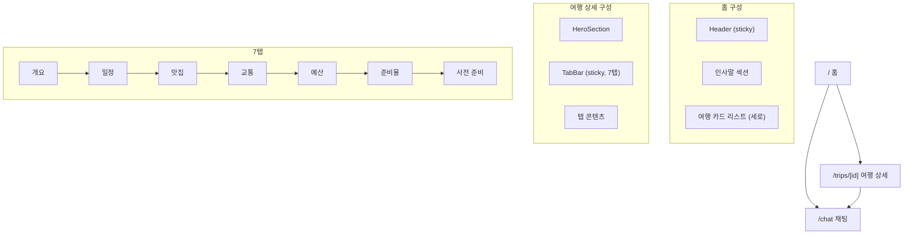
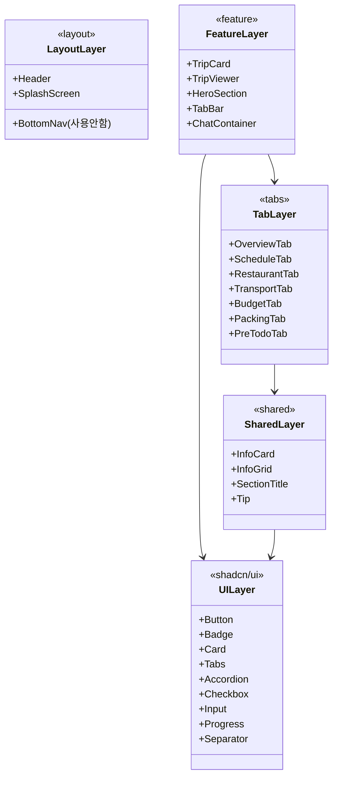
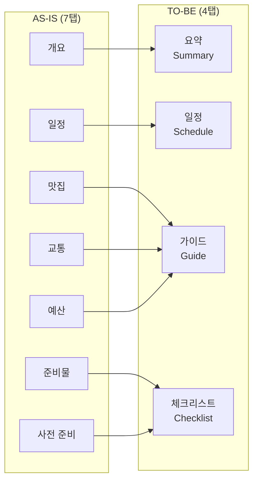
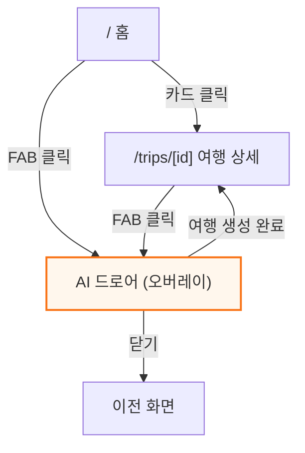
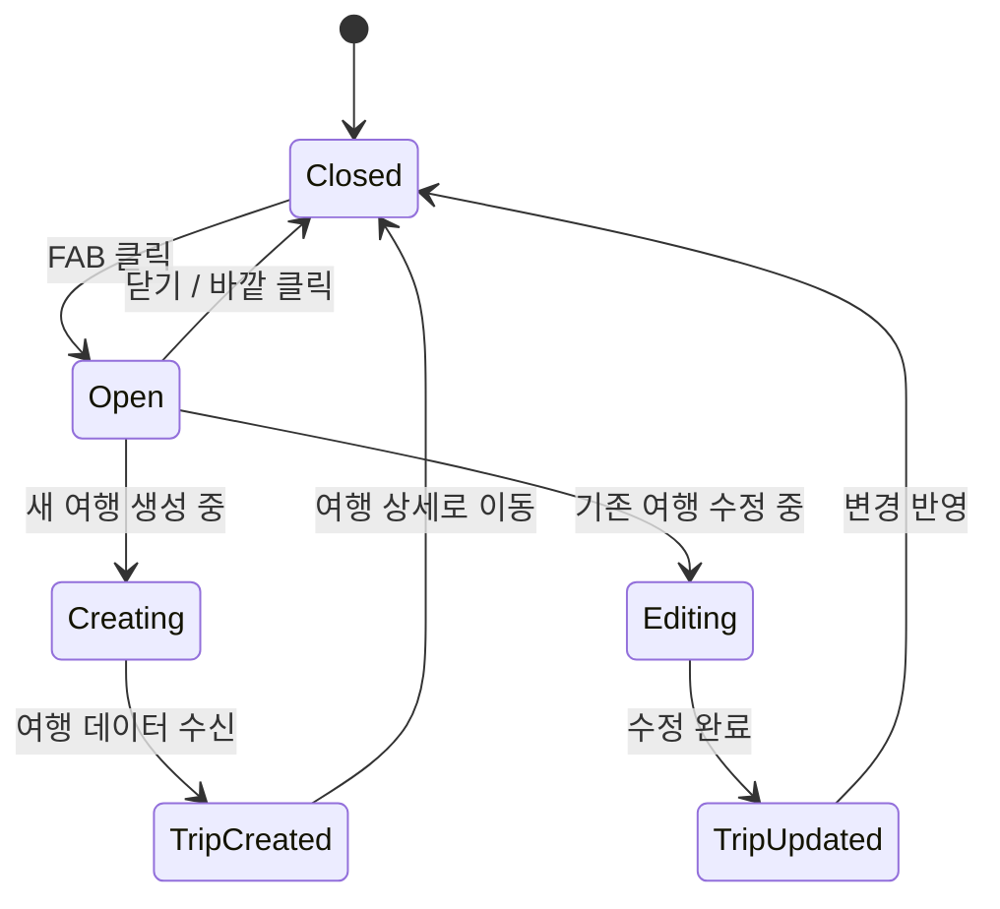
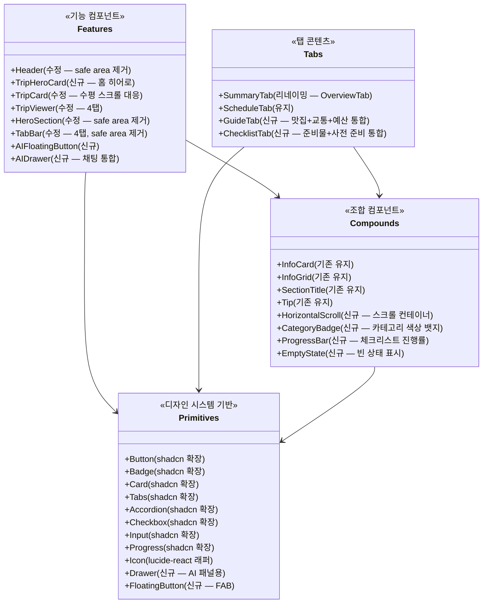

# Design System + Full Redesign 논리 모델

## 개요

| 항목 | 값 |
|------|-----|
| **요청** | 디자인 시스템 구축 + Trip.com 스타일 전체 리디자인 |
| **작성일** | 2026-03-14 |
| **영향 범위** | 전체 프론트엔드 (컴포넌트, 스타일, 레이아웃, Capacitor 제거) |
| **상태** | Draft |

---

## 입력 소스

### 분석한 코드

| 파일 | 주요 내용 |
|------|----------|
| `app/src/app/globals.css` | CSS 변수, 디자인 토큰, 타임라인 스타일, 애니메이션 |
| `app/src/types/trip.ts` | Trip, Day, TimelineItem 등 도메인 타입 (232줄) |
| `app/src/lib/constants.ts` | TAB_CONFIG (7탭), DAY_COLORS |
| `app/src/components/viewer/TripViewer.tsx` | 여행 상세 최상위 조합 컴포넌트 |
| `app/src/components/viewer/TabBar.tsx` | 7탭 네비게이션 (sticky, safe-area) |
| `app/src/components/viewer/HeroSection.tsx` | 여행 히어로 영역 (D-day, 공유, 태그) |
| `app/src/components/home/TripCard.tsx` | 홈 여행 카드 (리스트형) |
| `app/src/app/page.tsx` | 홈 페이지 (인사말 + 여행 목록) |
| `app/src/app/trips/[tripId]/page.tsx` | 여행 상세 페이지 |
| `app/src/app/chat/page.tsx` | 채팅 페이지 (별도 라우트) |
| `app/src/lib/capacitor.ts` | Capacitor 초기화 + Safe Area (제거 대상) |
| `app/src/components/CapacitorInit.tsx` | Capacitor 초기화 컴포넌트 (제거 대상) |
| `app/src/lib/map-utils.ts` | 지도 앱 열기 (Capacitor 의존, 수정 대상) |
| `app/src/components/layout/Header.tsx` | 공통 헤더 (safe-area 포함) |
| `app/src/app/layout.tsx` | 루트 레이아웃 (CapacitorInit 포함) |
| `app/package.json` | Capacitor 패키지 의존성 확인 |
| `app/src/components/viewer/tabs/OverviewTab.tsx` | 개요 탭 (항공, 숙소, 날씨, 일정요약, 팁) |
| `app/src/components/viewer/schedule/DayCard.tsx` | 일별 일정 카드 (아코디언 + 지도 + 타임라인) |

### 참조한 문서

| 파일 | 주요 내용 |
|------|----------|
| `CLAUDE.md` | 프로젝트 규칙 (7탭, 스타일, 색상 체계) |
| `MEMORY.md` | Safe Area 히스토리, 프로젝트 상태 |

---

## AS-IS (현재 구조)

### 디자인 토큰 체계

```
현재 토큰 구조:
globals.css @theme inline {
  ├── 프로젝트 커스텀 색상 (--color-bg, --color-accent, --color-trip-* 등)
  ├── 그림자 (--shadow-card, --shadow-card-hover)
  ├── 반지름 (--radius-card: 16px)
  ├── 폰트 (--font-sans, --font-display — 둘 다 Noto Sans KR)
  └── shadcn/ui 토큰 매핑 (oklch 기반)
}
```

**문제**: 프로젝트 토큰과 shadcn 토큰이 혼재. 타이포그래피 스케일 없음. 스페이싱 시스템 없음.

### 페이지 구조



### 컴포넌트 계층



### 현재 색상 체계

| 역할 | 색상 | Hex | 용도 |
|------|------|-----|------|
| Primary/Accent | 오렌지 | `#f97316` | 메인 브랜드, CTA, 기본 타임라인 |
| Trip Blue | 블루 | `#3b82f6` | 교통/이동 |
| Trip Green | 그린 | `#10b981` | 관광지 |
| Trip Pink | 핑크 | `#ec4899` | 맛집/식사 |
| Trip Purple | 퍼플 | `#8b5cf6` | 기타/숙소 |
| Trip Red | 레드 | `#ef4444` | 경고 |
| Trip Cyan | 시안 | `#06b6d4` | 날씨 |
| Background | 화이트 | `#ffffff` | 배경 |
| Card | 거의 화이트 | `#fafafa` | 카드 배경 |
| Text | 거의 블랙 | `#111827` | 본문 |
| Text Secondary | 그레이 | `#6b7280` | 보조 텍스트 |
| Text Tertiary | 연그레이 | `#9ca3af` | 3차 텍스트 |

### 발견된 문제점

- **P1. 디자인 토큰 비체계적**: 타이포그래피 스케일 없음, 스페이싱 하드코딩, 그림자 2개뿐
  - 위치: `globals.css:7-78`
  - 영향: 새 컴포넌트마다 임의 값 사용 -> 일관성 저하

- **P2. 탭 과다 (7개)**: 사용자가 원하는 정보까지 탭을 찾아가야 함. "준비물", "사전 준비"는 사용 빈도 낮음
  - 위치: `constants.ts:2-10`
  - 영향: 모바일에서 탭 스크롤 필요, 정보 분산

- **P3. 홈 화면 단조로움**: 세로 리스트 카드만 존재, Trip.com 같은 시각적 풍부함 부족
  - 위치: `page.tsx:64-79`
  - 영향: 첫 인상 약함, 여행 정보 미리보기 부족

- **P4. 채팅 별도 페이지**: 전체 페이지 전환 -> 컨텍스트 단절
  - 위치: `app/chat/page.tsx`
  - 영향: 여행 수정 시 채팅 <-> 상세 왕복 필요

- **P5. Capacitor 잔재**: 5개 파일에 Capacitor/Safe Area 코드 산재
  - 위치: `capacitor.ts`, `CapacitorInit.tsx`, `Header.tsx`, `TabBar.tsx`, `HeroSection.tsx`, `map-utils.ts`
  - 영향: 불필요한 패키지 의존성 (4개), 코드 복잡도

- **P6. Display 폰트 미활용**: `--font-display`가 `Noto Sans KR`로 본문과 동일
  - 위치: `globals.css:38`
  - 영향: 제목 <-> 본문 시각적 차별 부족

- **P7. 다크 모드 준비만**: `.dark` CSS는 있으나 토글 UI 없음, oklch 값이 프로젝트 커스텀 색상과 불일치
  - 위치: `globals.css:117-149`

---

## 설계 결정 (Design Decisions)

### DD-1. 보조 브랜드 컬러 선택

| 대안 | 색상 | 장점 | 단점 | 선택 |
|------|------|------|------|------|
| A. 딥 블루 `#1e40af` | 오렌지와 보색 관계 | 강한 대비, 신뢰감 | 너무 강한 대비, 여행 앱에 무거움 | --- |
| B. 틸 `#0d9488` (Teal-600) | 청록, 오렌지와 split-complementary | 시원함, 여행/탐험 느낌, 보조 CTA 적합 | --- | 선택 |
| C. 인디고 `#6366f1` | 기존 DAY_COLORS[1] | 익숙함 | 프라이머리와 조화 부족 | --- |

**결정 이유**: Teal은 오렌지와 색상환에서 split-complementary 관계로 조화롭고, 바다/여행/탐험 이미지와 어울림. Trip.com도 블루-틸 계열을 보조색으로 사용.

### DD-2. 탭 구조 재설계 방향

| 대안 | 구조 | 장점 | 단점 | 선택 |
|------|------|------|------|------|
| A. 5탭 축소 | 개요+일정+맛집+교통+예산 (준비물/사전준비 → 개요에 통합) | 단순함 | 개요 탭이 비대해짐 | --- |
| B. 4탭 재구성 | 요약 / 일정 / 가이드 / 체크리스트 | 정보 그룹핑 최적, 빈도 기반 | 기존 맛집/교통이 합쳐져 깊이 증가 | 선택 |
| C. 탭 없이 스크롤 | 단일 긴 페이지 (앵커 네비게이션) | 전체 조망 가능 | 정보 과부하 | --- |

**결정 이유**: 사용자의 실제 사용 패턴 고려. "일정"과 "요약"이 80%의 사용을 차지. "맛집/교통/예산"은 참고성 정보로 하나의 "가이드" 탭에 통합. "준비물/사전준비"는 "체크리스트" 탭으로 통합. 4탭이면 모바일에서도 스크롤 없이 표시 가능.

### DD-3. 채팅 통합 방식

| 대안 | 방식 | 장점 | 단점 | 선택 |
|------|------|------|------|------|
| A. 현행 유지 (별도 페이지) | `/chat` 라우트 | 단순 | 컨텍스트 단절 | --- |
| B. 플로팅 버튼 + 드로어 | FAB -> 오른쪽 서랍 패널 | 어디서든 접근, 컨텍스트 유지 | 서랍 크기 제한 | 선택 |
| C. 바텀시트 | 하단에서 올라오는 시트 | 모바일 친화 | 데스크탑에서 어색 | --- |

**결정 이유**: Trip.com 스타일의 AI 플로팅 버튼이 가장 자연스러움. 여행 상세를 보면서 동시에 AI와 대화 가능. 드로어는 반응형으로 모바일(풀스크린)/데스크탑(사이드패널) 대응 가능.

### DD-4. 홈 카드 레이아웃

| 대안 | 방식 | 장점 | 단점 | 선택 |
|------|------|------|------|------|
| A. 현행 세로 리스트 | 카드 수직 스택 | 단순, 스캔 용이 | 시각적 단조로움 | --- |
| B. 히어로 카드 + 수평 스크롤 | 다가오는 여행 = 히어로, 나머지 = 수평 | Trip.com 스타일, 시각적 풍부 | 여행 수 적으면 빈약 | 선택 |
| C. 그리드 카드 | 2열 그리드 | 한눈에 여러 여행 | 정보 밀도 높아 복잡 | --- |

**결정 이유**: 여행 앱에서 "다가오는 여행"이 가장 중요한 정보. 히어로 카드로 강조하고, 과거/미래 여행은 수평 스크롤로 탐색.

---

## TO-BE (변경 후 구조)

### 1. 디자인 토큰 시스템

#### 1-1. 색상 체계

```
Color Tokens
├── Brand
│   ├── --color-primary: #f97316 (오렌지)
│   ├── --color-primary-50 ~ 900 (오렌지 스케일)
│   ├── --color-secondary: #0d9488 (틸)
│   └── --color-secondary-50 ~ 900 (틸 스케일)
│
├── Semantic
│   ├── --color-bg: #ffffff
│   ├── --color-bg-secondary: #f9fafb (gray-50)
│   ├── --color-bg-tertiary: #f3f4f6 (gray-100)
│   ├── --color-surface: #ffffff (카드 배경)
│   ├── --color-surface-hover: #f9fafb
│   ├── --color-text-primary: #111827
│   ├── --color-text-secondary: #6b7280
│   ├── --color-text-tertiary: #9ca3af
│   ├── --color-text-inverse: #ffffff
│   ├── --color-border: #e5e7eb
│   ├── --color-border-light: #f3f4f6
│   ├── --color-success: #10b981
│   ├── --color-warning: #f59e0b
│   ├── --color-error: #ef4444
│   └── --color-info: #3b82f6
│
├── Category (여행 활동 유형)
│   ├── --color-cat-sightseeing: #10b981 (관광)
│   ├── --color-cat-food: #ec4899 (식사)
│   ├── --color-cat-transport: #3b82f6 (교통)
│   ├── --color-cat-accommodation: #8b5cf6 (숙소)
│   ├── --color-cat-shopping: #f59e0b (쇼핑)
│   └── --color-cat-activity: #06b6d4 (액티비티)
│
└── Overlay
    ├── --color-overlay-light: rgba(0,0,0,0.04)
    └── --color-overlay-dark: rgba(0,0,0,0.5)
```

#### 1-2. 타이포그래피 스케일

```
Typography Tokens
├── Font Family
│   ├── --font-sans: 'Noto Sans KR', system-ui, sans-serif (본문)
│   └── --font-display: 'Playfair Display', serif (히어로 제목 — 복원)
│
├── Font Size (4px 기반 스케일)
│   ├── --text-xs: 0.75rem (12px) / lh 1rem
│   ├── --text-sm: 0.875rem (14px) / lh 1.25rem
│   ├── --text-base: 1rem (16px) / lh 1.5rem
│   ├── --text-lg: 1.125rem (18px) / lh 1.75rem
│   ├── --text-xl: 1.25rem (20px) / lh 1.75rem
│   ├── --text-2xl: 1.5rem (24px) / lh 2rem
│   ├── --text-3xl: 1.875rem (30px) / lh 2.25rem
│   └── --text-4xl: 2.25rem (36px) / lh 2.5rem
│
└── Font Weight
    ├── light: 300
    ├── regular: 400
    ├── medium: 500
    ├── semibold: 600
    ├── bold: 700
    └── black: 900
```

> Tailwind CSS v4의 기본 타이포 스케일과 일치시키므로, 별도 커스텀 변수 정의 없이 Tailwind 유틸리티 클래스(`text-sm`, `text-lg` 등) 그대로 사용. `--font-display`만 별도 정의.

#### 1-3. 스페이싱 시스템

```
Spacing (Tailwind 4px 기반 — 커스텀 정의 불필요)
├── 1: 4px    (아이콘 간격)
├── 2: 8px    (요소 내부)
├── 3: 12px   (소형 간격)
├── 4: 16px   (기본 간격)
├── 5: 20px   (섹션 내부)
├── 6: 24px   (카드 패딩)
├── 8: 32px   (섹션 간격)
├── 10: 40px  (대형 간격)
└── 12: 48px  (페이지 마진)

Page Layout
├── --max-width: 1100px (콘텐츠 최대 너비)
├── --page-px: 20px (좌우 패딩, 모바일)
└── --page-px-lg: 32px (좌우 패딩, 데스크탑)
```

#### 1-4. Border Radius 시스템

```
Border Radius
├── --radius-sm: 6px (뱃지, 태그)
├── --radius-md: 8px (버튼, 입력)
├── --radius-lg: 12px (작은 카드)
├── --radius-xl: 16px (카드, 패널)
├── --radius-2xl: 20px (히어로 카드)
└── --radius-full: 9999px (원형, 필 버튼)
```

#### 1-5. Shadow 시스템

```
Shadows
├── --shadow-xs: 0 1px 2px rgba(0,0,0,0.04)
├── --shadow-sm: 0 1px 3px rgba(0,0,0,0.06), 0 1px 2px rgba(0,0,0,0.04)
├── --shadow-md: 0 4px 6px rgba(0,0,0,0.05), 0 2px 4px rgba(0,0,0,0.04)
├── --shadow-lg: 0 10px 15px rgba(0,0,0,0.06), 0 4px 6px rgba(0,0,0,0.04)
├── --shadow-xl: 0 20px 25px rgba(0,0,0,0.08), 0 8px 10px rgba(0,0,0,0.04)
└── --shadow-float: 0 8px 30px rgba(0,0,0,0.12) (플로팅 버튼/드로어)
```

---

### 2. 탭 구조 재설계 (7탭 -> 4탭)

#### AS-IS 7탭 -> TO-BE 4탭 매핑



#### 새로운 탭 상세

| 탭 | 아이콘 | 포함 내용 | 기존 탭 출처 |
|----|--------|----------|-------------|
| **요약** | 비행기 | 항공편, 숙소, 날씨, 일정 미리보기(Day 카드 그리드), 여행 팁 | 개요 |
| **일정** | 달력 | Day별 타임라인 + 지도 (기존과 동일, UI 개선) | 일정 |
| **가이드** | 나침반 | 서브 섹션: 맛집 / 교통 / 예산 (아코디언 or 서브탭) | 맛집+교통+예산 |
| **체크리스트** | 체크 | 서브 섹션: 준비물 / 사전 할 일 (진행률 바) | 준비물+사전 준비 |

```typescript
// TO-BE TAB_CONFIG
const TAB_CONFIG = [
  { id: 'summary',   label: '요약',       icon: 'Plane' },
  { id: 'schedule',  label: '일정',       icon: 'Calendar' },
  { id: 'guide',     label: '가이드',     icon: 'Compass' },
  { id: 'checklist', label: '체크리스트', icon: 'CheckSquare' },
] as const;
```

---

### 3. 페이지별 레이아웃 설계

#### 3-1. 전체 화면 흐름



#### 3-2. 홈 페이지 레이아웃

```
+--------------------------------------------------+
| Header: "My Journey"           [검색?]  [AI FAB]  |
+--------------------------------------------------+
|                                                    |
|  인사말: "좋은 아침이에요"                           |
|  부제: "다가오는 여행이 있어요!"                      |
|                                                    |
|  ┌────────────────────────────────────────────┐   |
|  │  HERO CARD (다가오는 여행)                    │   |
|  │  ┌──────────────────────────────────────┐  │   |
|  │  │  배경: destination 이미지 or 그라데이션  │  │   |
|  │  │  D-7 뱃지                             │  │   |
|  │  │  "오사카 3박 4일"                       │  │   |
|  │  │  2026.03.02 — 2026.03.05 · 2명        │  │   |
|  │  │  [준비 진행률 ████░░ 60%]              │  │   |
|  │  └──────────────────────────────────────┘  │   |
|  └────────────────────────────────────────────┘   |
|                                                    |
|  내 여행 (3)                          [+ 새 여행]   |
|  ┌──────┐ ┌──────┐ ┌──────┐                      |
|  │ Card │ │ Card │ │ Card │  ← 수평 스크롤         |
|  │ 도쿄  │ │ 제주  │ │ ...  │                      |
|  └──────┘ └──────┘ └──────┘                      |
|                                                    |
|  지난 여행 (2)                                     |
|  ┌──────┐ ┌──────┐                                |
|  │ Card │ │ Card │  ← 수평 스크롤                   |
|  └──────┘ └──────┘                                |
+--------------------------------------------------+
```

**변경 사항**:
- 다가오는 여행(가장 가까운 미래 여행)을 히어로 카드로 강조
- 여행 목록을 시간 기준으로 그룹핑 (다가오는 / 지난)
- 세로 리스트 -> 수평 스크롤 카드
- 채팅 버튼 -> 플로팅 AI 버튼으로 변경

#### 3-3. 여행 상세 페이지 레이아웃

```
+--------------------------------------------------+
| ← 뒤로     "오사카 3박 4일"      [공유] [AI FAB]   |
+--------------------------------------------------+
| HERO SECTION                                       |
|   D-7 뱃지                                         |
|   2026.03.02 — 2026.03.05 · 2명                   |
|   #맛집투어 #오사카성 #유니버설                       |
+--------------------------------------------------+
| [요약]  [일정]  [가이드]  [체크리스트]  ← 4탭        |
+--------------------------------------------------+
|                                                    |
|  (탭 콘텐츠)                                       |
|                                                    |
+--------------------------------------------------+
|                                        [AI FAB] ○ |  ← 우하단 플로팅
+--------------------------------------------------+
```

**변경 사항**:
- 탭바에서 "홈" 뒤로가기 제거 -> 일반 뒤로 버튼으로 헤더에 통합
- Safe Area 관련 패딩 모두 제거
- 4탭으로 축소
- AI FAB 버튼 추가 (기존 HeroSection의 "AI로 수정하기" 대체)

#### 3-4. AI 드로어 (채팅 통합)

```
기존: /chat (별도 페이지)
변경: 플로팅 버튼 -> 드로어 패널

모바일 (< 640px):
  풀스크린 슬라이드 (오른쪽에서)

데스크탑 (>= 640px):
  오른쪽 사이드 패널 (width: 400px)
  메인 콘텐츠와 나란히 표시
```



---

### 4. 컴포넌트 계층 설계



#### 컴포넌트 책임 정의

| 컴포넌트 | 담당 | 비담당 | 협력 |
|----------|------|--------|------|
| **Header** | 앱 타이틀, 뒤로가기 | 채팅 버튼 (FAB로 이동) | AIFloatingButton |
| **TripHeroCard** | 다가오는 여행 강조 표시 | 전체 여행 목록 | HorizontalScroll |
| **TripCard** | 단일 여행 요약 카드 | 클릭 네비게이션만 | --- |
| **AIFloatingButton** | FAB 렌더링, 드로어 트리거 | 채팅 로직 | AIDrawer |
| **AIDrawer** | 채팅 UI, 여행 생성/수정 | 여행 데이터 저장 | useTripStore |
| **GuideTab** | 맛집/교통/예산 통합 표시 | 개별 데이터 fetching | Accordion, CategoryBadge |
| **ChecklistTab** | 준비물+할 일 통합, 진행률 | 체크 상태 영속화 | storage, ProgressBar |
| **HorizontalScroll** | 수평 스크롤 컨테이너 + 스냅 | 콘텐츠 렌더링 | children |

---

### 5. Capacitor 제거 영향 분석

#### 제거 대상

| 구분 | 파일/코드 | 작업 |
|------|----------|------|
| **파일 삭제** | `app/src/lib/capacitor.ts` | 전체 삭제 |
| **파일 삭제** | `app/src/components/CapacitorInit.tsx` | 전체 삭제 |
| **코드 수정** | `app/src/app/layout.tsx:4,42` | `CapacitorInit` import/사용 제거 |
| **코드 수정** | `app/src/components/layout/Header.tsx:14` | `pt-[calc(0.75rem+var(--safe-area-top,0px))]` -> `pt-3` |
| **코드 수정** | `app/src/components/viewer/TabBar.tsx:16` | `pt-[var(--safe-area-top,0px)]` 제거 |
| **코드 수정** | `app/src/components/viewer/HeroSection.tsx:35` | `pt-[calc(2rem+var(--safe-area-top,0px))]` -> `pt-8` |
| **코드 수정** | `app/src/lib/map-utils.ts:1,13-14,18-20,38-44` | Capacitor import 제거, 웹 전용으로 단순화 |
| **코드 수정** | `app/src/app/layout.tsx:30` | `viewportFit: "cover"` 제거 |
| **패키지 제거** | `@capacitor/core`, `@capacitor/ios`, `@capacitor/splash-screen`, `@capacitor/status-bar`, `@capacitor/cli` | `npm uninstall` |
| **폴더 삭제** | `app/ios/` (gitignore됨) | 로컬에서 삭제 |
| **파일 삭제** | `app/capacitor.config.ts` (있다면) | 삭제 |

#### 파급 효과

- `map-utils.ts`의 `openInMapsApp` 함수는 웹 전용으로 단순화 (항상 Google Maps URL)
- `--safe-area-top` CSS 변수를 참조하는 모든 곳에서 제거 (3곳)
- SplashScreen 컴포넌트는 Capacitor와 무관 (자체 구현) -> 유지

---

### 6. 도메인 타입 변경

타입 구조(`trip.ts`)는 **변경 없음**. 디자인 리디자인은 UI 레이어만 변경하며, 데이터 모델은 그대로 유지.

단, 새로운 UI 지원을 위한 유틸리티 타입 추가 가능:

```typescript
// 홈 화면 그룹핑을 위한 유틸리티
type TripGroup = {
  upcoming: TripSummary[];  // 시작일이 오늘 이후
  ongoing: TripSummary[];   // 현재 진행 중
  past: TripSummary[];      // 종료일이 오늘 이전
};

// 새로운 4탭 ID
type TabId = 'summary' | 'schedule' | 'guide' | 'checklist';
```

---

## 변경 사항 요약

| 항목 | AS-IS | TO-BE | 비고 |
|------|-------|-------|------|
| **디자인 토큰** | 비체계적 (색상 위주) | 체계적 (색상+타이포+스페이싱+반지름+그림자) | globals.css 재구성 |
| **브랜드 컬러** | Primary만 (오렌지) | Primary(오렌지) + Secondary(틸) | 보조 CTA, 링크 등 |
| **Display 폰트** | Noto Sans KR (본문과 동일) | Playfair Display (복원) | 히어로 제목 차별화 |
| **탭 구조** | 7탭 | 4탭 (요약/일정/가이드/체크리스트) | 정보 그룹핑 개선 |
| **홈 레이아웃** | 세로 카드 리스트 | 히어로 카드 + 수평 스크롤 | 시각적 풍부함 |
| **채팅** | 별도 페이지 (/chat) | 플로팅 버튼 + 드로어 | 컨텍스트 유지 |
| **Capacitor** | 5개 파일에 산재 | 전체 제거 | 패키지 5개 제거 |
| **Safe Area** | 3개 컴포넌트에 CSS 변수 | 제거 | 웹 전용 |
| **신규 컴포넌트** | --- | Drawer, FAB, HorizontalScroll, TripHeroCard, GuideTab, ChecklistTab, CategoryBadge, EmptyState | 8개 |
| **삭제 컴포넌트** | --- | CapacitorInit, BottomNav | 2개 |
| **삭제 탭** | --- | RestaurantTab, TransportTab, BudgetTab, PackingTab, PreTodoTab -> GuideTab, ChecklistTab로 통합 | 5개 -> 2개 |

---

## 다음 단계

이 논리 모델이 승인되면:

1. **planner**로 구현 계획서 작성
   - Phase 1: Capacitor 제거 + 디자인 토큰 정리
   - Phase 2: 4탭 재구성 (GuideTab, ChecklistTab)
   - Phase 3: 홈 리디자인 (히어로 카드, 수평 스크롤)
   - Phase 4: AI 드로어 통합 (FAB + Drawer)
   - 각 Phase별 파일 변경 목록, 구현 순서, 완료 조건

2. **executor**로 Phase별 TDD 구현

### 검토 요청 사항

- [ ] 보조 브랜드 컬러 (틸 `#0d9488`)가 괜찮은지
- [ ] 4탭 구성 (요약/일정/가이드/체크리스트)이 적절한지
- [ ] 채팅을 드로어 방식으로 통합하는 것에 동의하는지
- [ ] 홈 히어로 카드 + 수평 스크롤 방향이 맞는지
- [ ] Playfair Display 폰트 복원 여부

---

## 변경 이력

| 날짜 | 변경 내용 | 작성자 |
|------|----------|--------|
| 2026-03-14 | 초안 작성 | Claude |
